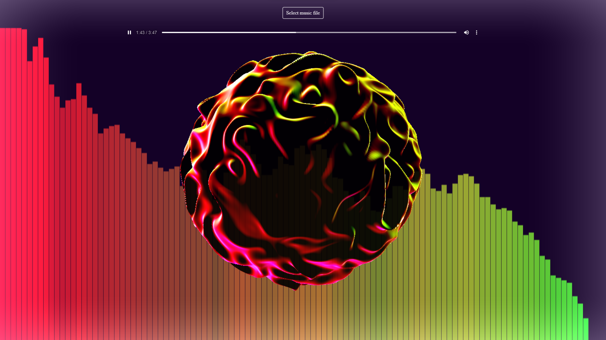

A struggle to understand and replicate [this](https://organic-sphere.vercel.app/)

<https://threejs-perlin-sphere-painterhalver.vercel.app/>

# TODOS

- [x] ~~Other ways to add music, AudioContext also gets sound stream from mic~~ (Can but bad sound recognition quality)
- [x] TintShaderPass or sth to light up the whole viewport
- [x] Maybe make the sphere a little transparent (change alpha of gl_FragColor < 1.0)
- [x] Fix spectrum canvas resize issue
